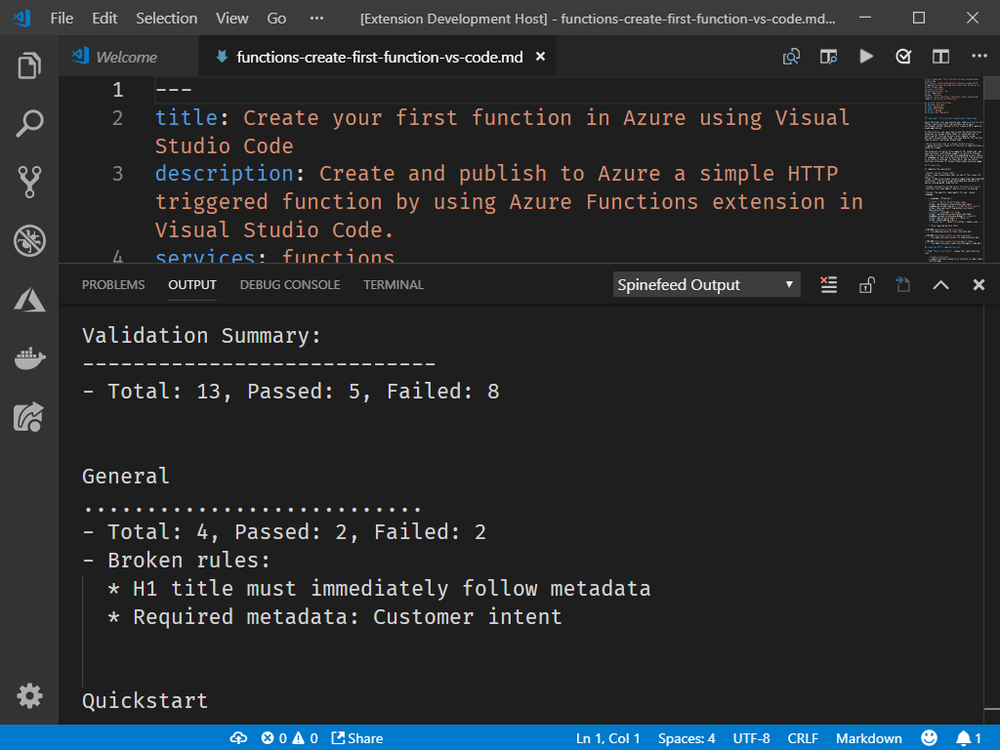

VS Code extension for [Spinefeed](https://github.com/craigshoemaker/spinefeed-function). Once installed, press `CMD + SHIFT + P` and select **Spinefeed: Get Content Model Feedback** to run the extension.

Spinefeed is also available via a [web interface](http://craigshoemaker.github.io/spinefeed-website).
